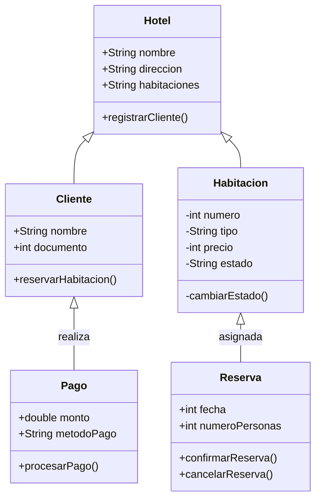

# Reto_02_POO

## Ejemplo de Sistema de Reservas y Pagos en un Hotel

El diagrama de clases ilustra un sistema de reservas para un hotel, que incluye las clases Hotel, Cliente, Habitacion, Pago y Reserva. El Hotelcuenta con atributos como el nombre, la dirección y una lista de habitaciones, además de un método para registrar clientes. Los Clientes pueden hacer Reservas de Habitaciones, y cada Reserva tiene atributos como la fecha y el número de personas, así como métodos para confirmar o cancelar. Cada Reserva está vinculada a una Habitación concreta. Los Clientes también pueden efectuar Pagos relacionados con sus reservas, y cada Pago incluye atributos como el monto y el método de pago, junto con un método para procesar el pago.
