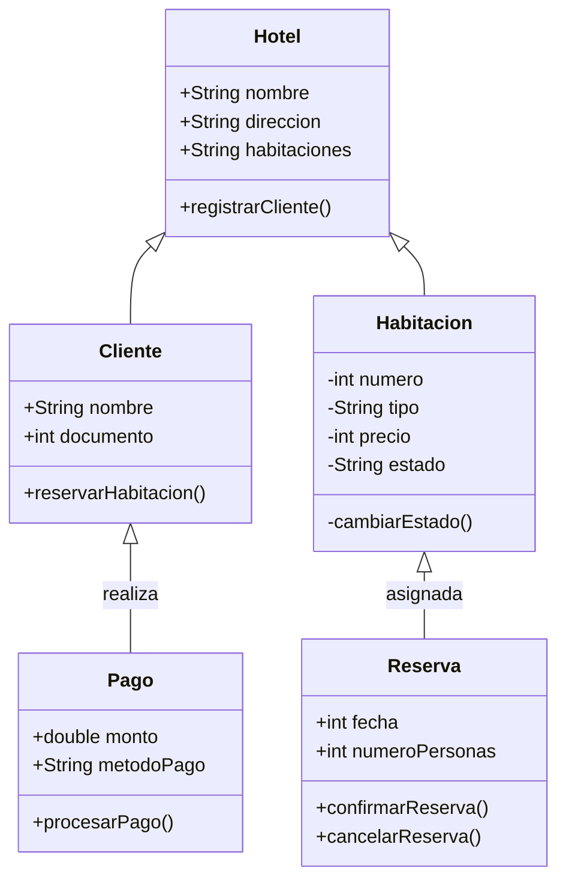

# Reto_02_POO

## Ejemplo de Sistema de Reservas y Pagos en un Hotel

```mermaid
classDiagram
    Hotel <|-- Cliente
    Hotel <|-- Habitacion
    Cliente <|-- Pago : realiza
    Habitacion <|-- Reserva : asignada
    Hotel : +String nombre
    Hotel : +String direccion
    Hotel : +String habitaciones
    Hotel: +registrarCliente()
    class Cliente{
      +String nombre
      +int documento
      +reservarHabitacion()
    }
    class Habitacion{
      -int numero
      -String tipo
      -int precio
      -String estado
      -cambiarEstado()
    }
    class Pago{
      +double monto
      +String metodoPago
      +procesarPago()
    }
    class Reserva{
      +int fecha
      +int numeroPersonas
      +confirmarReserva()
      +cancelarReserva()
    }
```
